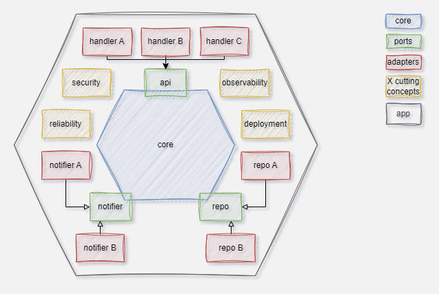

# Sapper

> **_WARNING:_**  Sapper is still under development. Breaking changes can occur at any time.

Sapper is **CLI** tool that enables you to rapidly create, extend, and update **C++ microservices**. It is based on an ever growing template repository --- the **brick** repo --- with a focus on cloud native technology from which you can compose your microservices, e.g.:
- http and gRPC handler
- postgreSQL database
- JWT based authentication
- docker and kubernetes
- support for AWS, Azure, and GCP
- ...

## Foundation

Besides using **C++**, the microservices that can be created with Sapper are constrained by the following:

### Linux AMD64

Sapper and the microservices created with it have a built in support for Linux on AMD64. No efforts are planned to support other platforms. On Windows, the usage of [wsl](https://learn.microsoft.com/en-us/windows/wsl/about) is recommended.

### Hexagonal architecture

The structure of each microservice follows the [hexagonal](https://en.wikipedia.org/wiki/Hexagonal_architecture_(software)) -- aka ports & adapters -- architecture:


| Layer | Desription| Depends on |
| :------ | :-----| :---- |
| ports | Domain entities and **interfaces** that the core needs to work with.| - |
| core | Contains all **business logic** without directly depending on any infrastructure (e.g. databases). | ports |
| adapters | **Implementation** of the interfaces defined in the ports layer. Adapters should be independent from each other, but often rely on third party libraries. | ports, external libraries|
| app | The **main** application that brings everything together: Reads configuration, instantiates the core, instantiates the adapters, injects the adapters into the core, calls the handler. | core, adapters |

### Conan package manager

Dependencies on 3rd party libraries are managed by the [conan](https://conan.io/) package manager. Thus, each microservices has a *conanfile.txt* in its root folder.

### Make

Each microservice contains a [Unix Makefile](https://www.gnu.org/software/make/manual/make.html) in its root folder that allows to build, test, and deploy the service. Sapper uses the GNU *make* command during some operations. By default [CMake](https://cmake.org/) and [CTest](https://cmake.org/cmake/help/latest/manual/ctest.1.html#) are used for building and testing a microservice, respectively.

### Microservice-Essentials library

The [Microservice Essentials](https://github.com/seboste/microservice-essentials) library implements or facilitates the implementation of cross cutting concepts in microservices such as request handling, observability, error handling, and many more. The *cmd* and many of the *adapters* depend on this library, which in turn has no transitive dependencies by design.

## Getting started

1. Make sure that [Conan](https://conan.io/) v1.x, [CMake](https://cmake.org/), [make](https://www.gnu.org/software/make/manual/make.html), and a C++ toolchain (e.g. [clang](https://clang.llvm.org/), [gcc](https://gcc.gnu.org/)) is available in your linux build environment. If that's the case, the following commands run without problems:
   ```bash
   conan --version
   cmake --version
   make --version
   gcc --version    #alternative 1
   clang --version  #alternative 2
   ```
   
3. [Install Go](https://go.dev/doc/install) by e.g. running:

    ```bash
    wget https://go.dev/dl/go1.20.4.linux-amd64.tar.gz
    rm -rf /usr/local/go 
    tar -C /usr/local -xzf go1.20.4.linux-amd64.tar.gz
    export PATH=$PATH:/usr/local/go/bin
    go version
    ```

4. Install **Sapper**:
    ```bash
    go install github.com/seboste/sapper@latest
    export PATH=$PATH:~/go/bin
    sapper version
    ```

5. Create your first **Sapper** C++ microservice:    
    ```bash
    sapper service add my-service
    cd my-service    
    sapper brick add handler-http
    sapper brick add observability-structured-logging
    sapper brick add repo-in-memory
    make build
    ```
    > **_INFO:_**  hit enter when prompted to specify parameters. It is recommended to execute the commands in a git repository directory and commit the changes after executing each line. In that way, changes made by Sapper can be reconstructed easily.

    The just created service has a http handler that exposes two example REST endpoints, one for setting and one for getting an example entity. Logs are written to standard output in JSON format. The entities are managed in memory by a simple C++ map.

6. Run and test your service:
   ```bash
   export LOG_LEVEL=TRACE
   make run
   ```
   The service is now up and running. You can now call the service from a different terminal:
   ```bash
   curl -X PUT localhost:8080/Entity/test -H "Content-Type: application/json" -d'{"id":"test","string_property":"str","int_property":42}'
   curl localhost:8080/Entity/test
   ```
   An example entity has been stored in and retrieved again from the service. As tracing has been turned on, extensive logs have been written to the console.

7. Add your business code to the core and adapt the ports and adapters to your needs. Voilà, your first C++ microservice is ready.

## Main Features

### Create Microservices

A new Sapper C++ microservice can be created by running the 
```bash 
sapper service add <servicename>
``` 
command. This will create a new directory containing the initial hexagonal microservice structure along with a ``conanfile.txt`` to manage dependencies, a ``CMakeLists.txt``, and a ``Makefile``. Many source files 
include code lines that define so called sapper sections:
```c++
//<<<SAPPER SECTION BEGIN **SOME_SECTION_NAME**>>>
...
//<<<SAPPER SECTION END **SOME_SECTION_NAME**>>>
```
Sapper uses them to identify code areas that may need to be replaced, merged, appended, or prepended by when adding new sapper bricks to the microservice. Modify them only with caution as it might impede sapper.

You can build and execute the service with the following commands:
```bash
cd <servicename>
sapper service build .
make run
```
As this microservice only contains example ports and a simple example core, the executable returns immediately. You need at least one handler and a repository (aka a DB) for your microservice to do something somewhat meaningful.

### Extend Microservices

New features (e.g. handlers, databases, notifiers, security, observability, deployment, ...) can be added to a Sapper C++ microservices by adding so called bricks. Use the following command to get a complete list of available bricks including the unique identifier, the version, and a brief description of each brick:
```bash
sapper brick list
```
Then add the desired brick to your microservice:
```bash
sapper brick add <brickname>
```
and enter values for parameters when prompted. New code from the brick library is added to the microservice's codebase (typically by adding another adapter) and integrated into the microservices codebase (typically by adding a few lines of code to the ``main.cpp`` in the ``app`` folder and adding dependencies to 3rd party libs to the ``conanfile.txt``).

> **_INFO:_** Bricks assume that the ports are unchanged by the developer, i.e. the microservice works on that example entity mentioned earlier. Thus, it is recommended to first add the desired bricks to your microservice and then adapt the code to your needs and not the other way around. You can still add bricks later, but adding some of the files may fail and more manual work may be required.

> **_INFO:_** CI ensures that the microservice can be built successfully out of the box when adding a single brick to the initial microservice. However, it is not guaranteed that all possible combinations of bricks can be built successfully (e.g. due to dependency clashes). Some manual fixes may be required.

### Update Dependencies

A regular maintenance task for developers is to update the dependencies. For security reasons and because frequent small increments typically are less error prone and work intense than infrequent big increments, this  task should be done often. Sapper can facilitate this process by running the command
```bash
sapper service upgrade .
```
It will build the service, identify which dependencies are not up to date, and then in a bisection method update each dependency until the highest dependency library version is identified for which the build process without code changes is successful.

### Customize Sapper

Sapper obtains the brick library from a [github](https://gthub.com) repository. This is [https://github.com/seboste/sapper-bricks](https://github.com/seboste/sapper-bricks) by default. Sapper allows to replace or extend the brick library or replace individual bricks by managing remotes. Call 
```bash 
sapper remote --help
```
for more details. This can for example be useful for organizations that want to provide custom C++ microservice templates to be used by all teams of that organization. Please refer to [https://github.com/seboste/sapper-bricks](https://github.com/seboste/sapper-bricks)'s **README.md** for details on how to create your own Sapper bricks. 

> **_INFO:_** Sapper can only be as good as the underlying brick library. If you create bricks that may be useful to the general public, please consider contributing by creating a pull request to [https://github.com/seboste/sapper-bricks](https://github.com/seboste/sapper-bricks).

## Reference

For a complete description of the commands and subcommands please refer to the tool's help:
```bash
sapper --help
sapper <command> --help
```
